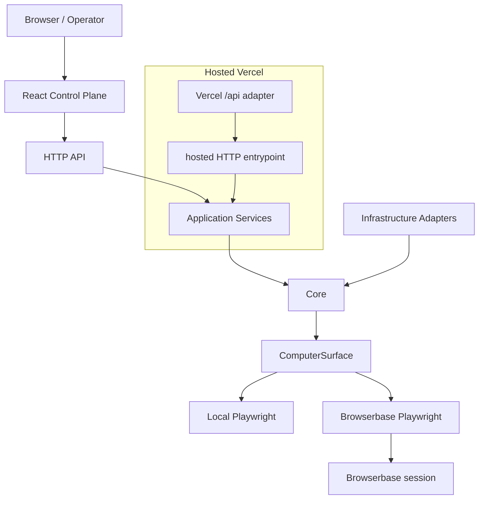

# Computer-use capability platform

LLM discovers a UI workflow once. Typed capability artifacts replay it deterministically with **zero LLM decisions**. Humans can take control of the **same** browser session through the control-plane API.

## Architecture

```text
Browser / Operator
       ↓
React Control Plane
       ↓
HTTP API  (apps/api)
       ↓
Application Services
       ↓
Core
       ↑
Infrastructure Adapters
```

Hosted deployment is a control plane on Vercel. The browser itself is **not** launched inside the serverless function:

```text
Web on Vercel
   ↓
Vercel API (orchestration)
   ↓
ComputerSurface
   ├── LocalPlaywrightSurface     (pnpm --filter api dev)
   └── BrowserbasePlaywrightSurface  (Vercel hosted)
             ↓
       Browserbase session
```

Serverless runtimes cannot keep a local Chromium process. Browserbase holds the remote persistent browser; Vercel remains the API/UI control plane. Discovery, replay, policy, and intervention stay on the existing `ComputerSurface` contract.



The frontend never talks to Playwright or the discovery model. The API owns all execution authority. Root `/api` is only the Vercel adapter. Canonical discovery is provider-independent: any supported genuine LLM (Gemini, OpenAI, or a capable local model) can produce a capability artifact; replay of that artifact uses zero LLM decisions. Demo SauceDemo credentials are invocation inputs for the take-home only; production session secrets belong on `ApplicationProfile.bootstrapSession`, not the business input contract.

## Workspace structure

```text
/api                      Vercel deployment adapter only
/apps/api                 Actual control-plane / execution API application
/apps/web                 React control plane
/packages/contracts       Shared serializable schemas/contracts
/artifacts                Generated capability artifacts
/evidence                 Committed assignment proof
/docs                     Architecture decisions
```

API layout:

```text
apps/api/src/
  core/           business rules (capability, execution, intervention, policy, surface, errors)
  application/    use-case orchestration (discovery, replay, jobs)
  infrastructure/ adapters (browser, persistence, observability)
  interfaces/     HTTP + CLI
  profiles/       target-application specifics (SauceDemo)
```

Evidence always writes under repo-root `evidence/` via `resolveRepoRoot()` + config — never under `apps/api/evidence/` or `apps/evidence/`. Tests write to isolated temp/`test-results` directories. Live interventions share the same HTTP control plane (`server.ts`); `live-intervention.ts` only registers the in-process session.

## Setup

```bash
corepack enable
pnpm install --frozen-lockfile
pnpm playwright:install
```

Secrets are **not** in git. The repo only ships `.env.example` (names, empty values). Real keys live in **Vercel encrypted environment variables** (Sensitive — not `VITE_*`, not readable from the static UI).

### Without live services

No model key and no SauceDemo network are required for:

```bash
pnpm typecheck
pnpm lint
pnpm test
pnpm build
pnpm demo:offline
```

`pnpm demo:offline` exercises the architecture with a scripted model. It is **not** genuine LLM discovery evidence. Live discovery/replay need a provider key and the public SauceDemo site.

Local API/CLI still need the same names in a **gitignored** `.env` (never commit it). Pull from Vercel after login if you want a local copy:

```bash
pnpm dlx vercel@58 env pull .env.local
```

`.env.local` is gitignored. Do not copy secrets into tracked files.

### Environment names

**Hosted Vercel live execution requires only two additional secrets:**

| Name | Where | Notes |
| --- | --- | --- |
| `BROWSERBASE_API_KEY` | Vercel Sensitive | Required for hosted Browserbase. Never `VITE_*`. Never commit. |
| `BLOB_READ_WRITE_TOKEN` | Vercel Sensitive | Hosted artifact/evidence/session persistence across invocations. |

Vercel automatically selects Browserbase when `VERCEL` is present. Local development (`pnpm --filter api dev`) automatically selects local Chromium. Do not set `BROWSER_RUNTIME` or `BROWSERBASE_PROJECT_ID`.

This assessment uses one fixed Browserbase project ID in server-side configuration (`HOSTED_BROWSERBASE_PROJECT_ID`). It is not a secret and is not an environment variable. Production systems with multiple environments would externalize that identifier. Gemini variables already exist on Production and remain unchanged.

| Name | Where | Notes |
| --- | --- | --- |
| `AI_PROVIDER` | local | `gemini`, `openai`, or `ollama`. Vercel defaults to `gemini`. |
| `GEMINI_API_KEY` | Vercel Sensitive + local gitignored env | Existing discovery secret |
| `GEMINI_MODEL` | local | Defaults to `gemini-flash-latest` |
| `OPENAI_API_KEY` | local gitignored env | Optional local provider. Never `VITE_OPENAI_API_KEY` |
| `OPERATOR_PORT` | local API | default `8787` |
| `VITE_API_BASE_URL` | web only | `http://127.0.0.1:8787` in dev; not a secret |

### Hosted UI

Static operator UI plus API: **https://interface-jet-pi.vercel.app**

Vercel project: [karlas-projects-a8f8a380/interface](https://vercel.com/karlas-projects-a8f8a380/interface)

**Local mode** (`pnpm --filter api dev`): Chromium on the loopback API + filesystem artifacts/evidence. No Browserbase account required.

**Hosted Vercel mode:** Vercel is the control plane and automatically selects Browserbase. Gemini is the discovery model. `@vercel/blob` persists artifacts, evidence, and session metadata. Live View takeover uses the same session; resume reconnects.

This is **implemented**. It is **live-verified** only when Production `GET /api/health` reports `browserRuntime=available` and a real hosted run has been promoted under `evidence/hosted/`. This repository currently has no hosted evidence directory.

If `BROWSERBASE_API_KEY` or `BLOB_READ_WRITE_TOKEN` is missing, `GET /api/health` reports unavailable (`BROWSERBASE_API_KEY_MISSING` or `BLOB_STORAGE_NOT_CONFIGURED`) and the UI stays catalog/evidence-only. The frontend shows that unavailable runtime instead of implying hosted execution is proven. Do not add `VITE_*` copies of these secrets.

## Run (one UI URL)

```bash
# terminal 1 — API only (JSON on :8787; does not serve the React SPA)
pnpm --filter api dev

# terminal 2 — React control plane (proxies /api → :8787)
pnpm --filter web dev
```

**Open only:** http://127.0.0.1:5173

`:8787` is the API. Visiting it will not show a second copy of the UI (unless you explicitly set `SERVE_WEB=1` after `pnpm --filter web build` for a single-port production-style serve).

CORS allows only `http://127.0.0.1:5173` and `http://localhost:5173`.

## Discovery

```bash
# Live LLM (default) — fails clearly if provider is not configured
pnpm discover --goal "Add Sauce Labs Backpack to the cart and reach the cart page" \
  --target https://www.saucedemo.com \
  --params '{"productName":"Sauce Labs Backpack"}'

# Explicit offline scripted (NOT LLM evidence)
pnpm discover --scripted --goal "..." --target https://www.saucedemo.com \
  --params '{"productName":"Sauce Labs Backpack"}'
```

Or from the web UI: `/discovery` (defaults to **LLM Discovery**).

## Replay

```bash
pnpm replay --capability-id cart.add-product --version 2 \
  --inputs '{"productName":"Sauce Labs Backpack","username":"standard_user","password":"secret_sauce"}'
```

Deterministic replay performs **zero LLM decisions**.

Unattended agent invocation (`POST /api/agent/capabilities/:id/versions/:version/invoke`) uses the same replay path and requires `status: approved`. Control-plane / CLI replay of a **draft** needs `ALLOW_DRAFT_REPLAY=1` or an explicit `allowDraft` option on the review/demo CLIs.

## Intervention demo

```bash
pnpm operator --target https://www.saucedemo.com
# Open /interventions/:id in the web UI — same Playwright session
```

## Tests & quality gates

```bash
pnpm typecheck
pnpm lint
pnpm test
pnpm build
```

Root scripts run across `apps/*` and `packages/*`.

## Evidence

See [`evidence/README.md`](./evidence/README.md). Canonical folders prove discovery, replay success/business-outcome/hard-failure, recoverable runtime condition, and same-session handoff.

Requirement → code/test/evidence map: [`docs/requirement-matrix.md`](./docs/requirement-matrix.md).

## Optional stretch goals implemented

Two stretch goals only. Depth over breadth. Not implemented: Playwright codegen, LLM-assisted replay fallback, multi-run stability load, MCP/OpenAI/Gemini tool servers, or a production approval workflow.

### Agent-facing capability interface

Agents discover capabilities through a purpose-built catalog, not the raw artifact:

- `GET /api/agent/capabilities` — typed descriptors (id, version, description, status, inputs, outputs). No locators, recovery trees, Playwright, or evidence paths.
- `GET /api/agent/capabilities/:capabilityId/versions/:version` — one descriptor.
- `POST /api/agent/capabilities/:capabilityId/versions/:version/invoke` — validate arguments against `contract.inputs`, then call the existing deterministic replay application service.

Hosted Vercel serves the GET catalog at `/agent`. Session bootstrap fields (`username` / `password`) are omitted from public descriptors. When hosted health reports `browserRuntime=available`, POST invoke uses the same `replayCapabilityApp` path against Browserbase. When the hosted browser runtime is unhealthy, invoke returns `501 LOCAL_RUNTIME_REQUIRED` and the UI stays catalog-only. That catalog-only state is **not** live hosted proof.

```bash
curl \
  -X POST \
  http://127.0.0.1:8787/api/agent/capabilities/cart.add-product/versions/2/invoke \
  -H 'Content-Type: application/json' \
  -d '{
    "arguments": {
      "productName": "Sauce Labs Backpack"
    }
  }'
```

Demo session bootstrap (`username` / `password`) is filled from the SauceDemo profile / env. The invoke result uses the existing taxonomy: `success | business_outcome | intervention_required | failure`. Recorded local-fixture evidence: `evidence/agent-invocation/canonical/` (`llmDecisionCount = 0`).

A pure `toOpenAITool(descriptor)` mapper exists for a future protocol. Core does not speak OpenAI `tool()` / Gemini function declarations.

### Confidence & approval

Discovery compiles artifacts as **draft**. That is governance metadata on the document; `id`+`version` execution steps stay immutable. Unattended agent invocation requires **approved**. Local review of a draft is explicit: `ALLOW_DRAFT_REPLAY=1` or the canonical/demo CLIs pass `allowDraft: true` with `executionContext: review`.

Reliability is counted from deterministic replay `evidence/replay/**/result.json` for that exact id+version. Exposed counts: successful, business outcomes, hard failures, sample size. `executionReliability` is successful / (successful + hard failure). Business outcomes are not infrastructure failures. Fewer than two runs → `insufficient_data`. No invented `confidence: 0.97`. `approvalReadiness` (`insufficient_data | candidate | degraded`) is advisory and never mutates draft → approved.

The Capability detail page in the web control plane shows these counts.

## Security boundaries

- Loopback bind (`127.0.0.1`) for the control plane
- Restricted CORS origins
- Fail-closed policy / risk taxonomy
- Redaction of secrets in evidence
- API `core/` does not import Express, React, Playwright, or LLM SDKs (those adapters live in `infrastructure/` / application discovery models)

## Demo note

The architecture targets financial back-office systems. The demonstration intentionally uses a safe public proxy application (SauceDemo) rather than a real banking system. SauceDemo selectors live in an application profile — not in the generic computer surface.

**Offline scripted mode** (`pnpm demo:offline` / UI “Offline Scripted Demo”) exists only to exercise the architecture without model access. It does **not** satisfy the assignment’s required genuine LLM discovery evidence.

## Reviewer path

1. `pnpm install`
2. `pnpm playwright:install`
3. Configure a live cloud LLM. Canonical evidence in this repo was produced with:

```bash
AI_PROVIDER=gemini
GEMINI_MODEL=gemini-flash-latest
pnpm evidence:canonical
```

   OpenAI (`AI_PROVIDER=openai` + `OPENAI_API_KEY`) is another supported provider. Ollama is for local experimentation and is **not** promoted as canonical.
4. `pnpm dev:api` and `pnpm dev:web`
5. Open Discovery → leave **LLM Discovery** selected → Start
6. Inspect the generated capability under Capabilities
7. Run deterministic replay from the UI or CLI
8. Trigger business outcome / hard failure / recoverable interstitial / intervention demos as documented in `evidence/README.md`

CLI equivalents:

```bash
pnpm discover --goal "Add Sauce Labs Backpack to the cart and reach the cart page" \
  --target https://www.saucedemo.com \
  --params '{"productName":"Sauce Labs Backpack"}'

pnpm replay --capability-id cart.add-product --version 2 \
  --inputs '{"productName":"Sauce Labs Backpack","username":"standard_user","password":"secret_sauce"}'

pnpm demo            # LIVE LLM (requires provider)
pnpm demo:offline    # explicit scripted architecture exercise
```

